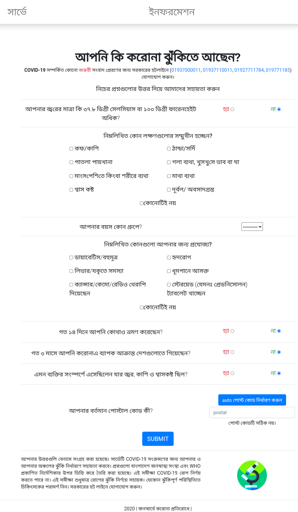
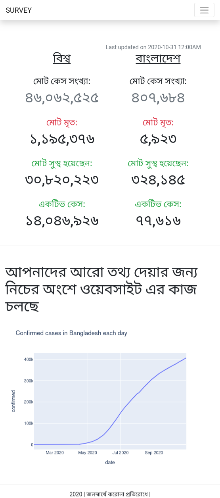
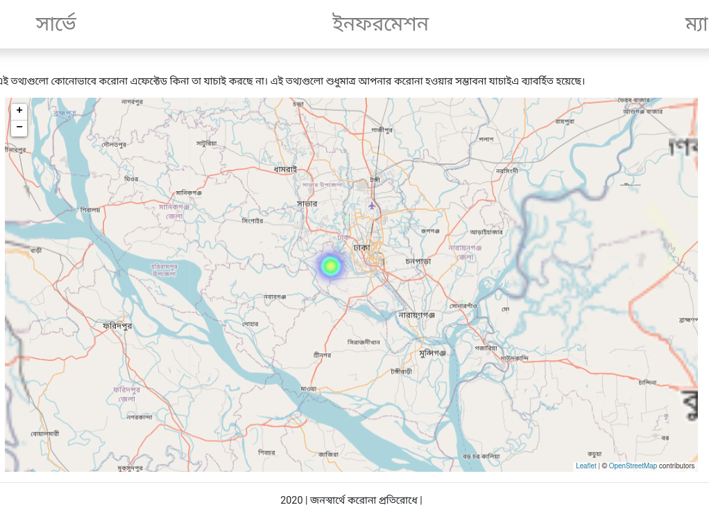

# Bangladesh Corona Survey
A web app made to take survey and visualize the effect of corona in Bangladesh. This app is WIP. I became very busy and abandoned the advertisement of this app. So currently, there is no data (except those that are parsed from the official corona status of Bangladesh).

If the site status badge tells the website is `LIVE`, then you can visit the website on [bangladesh-corona-survey.herokuapp.com/](https://bangladesh-corona-survey.herokuapp.com/)

The most interesting part (the reason why this repo is not deleted) is the implementation of heatmap, due to the score of the survey. According to each persons survey data, they are provided probability of chance of being infected by COVID-19. Using this probability and their density in different places, a heatmap is created using the help of popular [Leaflet](https://leafletjs.com/) library (See the third image).

Image preview of the website:

